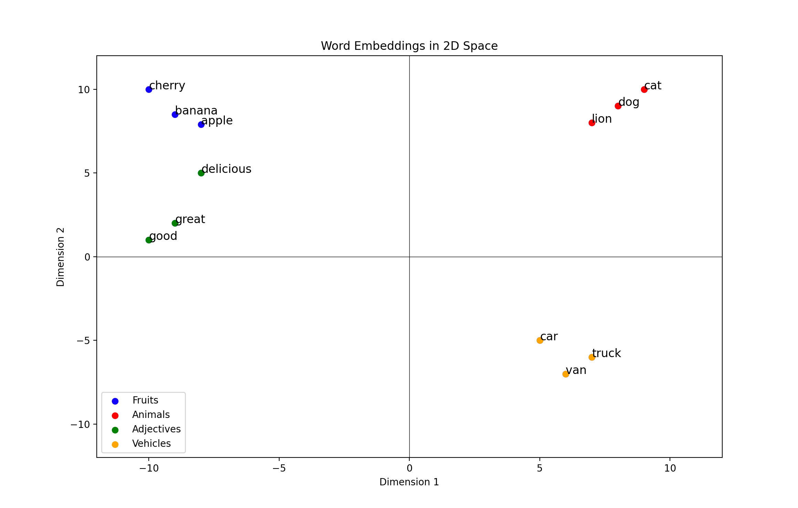

# How Large Language Models (LLMs) Work

## LLMs are fancy autocomplete systems

LLMs such as OpenAI’s ChatGPT and Anthropic’s Claude are AI-powered assistants. When you give them a query or instruction — called a `prompt` — they generate a response tailored to that input.
 


Here’s how LLM works: when you give an LLM a prompt, it generates text - one word at a time. After predicting a word, it adds that word to the prompt and uses the updated prompt to predict the next word. This process repeats again and again until it produces a full response.

<br>


This basically means that LLMs are just autocomplete systems trained to predict the next word in a sequence based on the words that came before it. This is similar to how your phone's keyboard suggests the next word as you type a message.

<br>

So why do LLMs seem so smart while your phone’s autocomplete can feel… well, silly? The difference comes down to training. LLMs are trained on massive datasets containing trillions of words -- allowing them to learn complex patterns and relationships between words. This enables them to generate coherent and contextually relevant responses.

## How do LLMs learn? A beginner's guide to tokens, embeddings, pretraining, and fine-tuning

<em>Interactive demo: https://ig.ft.com/generative-ai</em>

Imagine you’re trying to teach a computer what the word “dog” means. To you, “dog” brings up images of a wagging tail, barking, or a furry pet. But to a computer, it’s just a random string of letters: D-O-G. Computers love numbers, not words, so we need a way to turn words into something they can work with.

The first idea is to assign each word a unique number, like “cat” = 17, “dog” = 42, “banana” = 99. This is called `tokenization`, where each entity is called a `token` and the number representing it is called its `token ID`.

| Token   | Token ID |
|---------|----------|
| cat     | 17       |
| dog     | 42       |
| banana  | 99       |

**NOTE**: For simplicity, we're considering 1 word = 1 token. In reality, a token could be a full word (`dog`), part of a word (`ing` in `running`), punctuation (`.` or `,`), or even a single character in some cases (see [why LLMs break words into pieces](#tokenization-revisited-why-llms-break-words-into-pieces)).

Token IDs like "42" for "dog" and "17" for "cat" are just unique labels — they don’t tell the computer anything about how the words are related. Token IDs are like jersey numbers: useful for identification, but meaningless for understanding.

**What we want**: A way to represent words so the computer knows:
  - “dog” and “cat” are similar (both are animals).
  - “king” and “queen” are related (both are royalty).
  - “apple” and “car” are totally different.

### Solution: Word embeddings!

To help the computer understand relationships between tokens, each token ID is mapped to **an array of numbers** called an `embedding vector`. These vectors capture the meaning and context of each token.

For example (using made-up numbers):

| Token   | Token ID | Embedding Vector     |
|---------|----------|----------------------|
| cat     | 17       | [0.8, 0.8]           |
| dog     | 42       | [0.7, 0.7]           |
| banana  | 99       | [-0.6, 0.5]          |

If we plot these vectors in a 2D space, you’d see that “cat” and “dog” are close together, while “banana” is far away.
<br><br><br>

- The vectors for "cat" and "dog" are similar, so the model knows they’re related (both are animals).
- The vector for "banana" is different, so the model knows it’s not related to "cat" or "dog" (it’s fruit).

LLMs use thousands of dimensions (not just 2), like a 3D, 4D, or even 1000D map, to capture super detailed relationships.

| Token   | Token ID | Embedding Vector (Made up numbers for illustration)                         |
|---------|----------|-----------------------------------------------------------------------------|
| cat     | 17       | [0.8, 0.2, 0.1, 0.5, 0.9, 0.3, 0.4, 0.6, 0.2, 0.8, 0.1, 0.7, 0.4, 0.5, 0.3] |
| dog     | 42       | [0.7, 0.3, 0.2, 0.4, 0.8, 0.1, 0.6, 0.5, 0.2, 0.9, 0.3, 0.4, 0.5, 0.6, 0.7] |
| banana  | 99       | [0.1, 0.9, 0.5, 0.3, 0.2, 0.8, 0.4, 0.6, 0.7, 0.1, 0.5, 0.9, 0.3, 0.2, 0.4] |

Don’t be scared about “dimensions”—they’re just a set of numbers to describe a word (e.g., is it an animal? Positive? Food-related?).

### How Embeddings are generated?
Okay, so we need these embeddings for words. But how do we make them?

LLMs use a process called `pretraining`. Here’s a simplified version of how it works:

- The LLM scans a massive pile of text (like Wikipedia, books, or social media) and lists all unique tokens. Say it finds 50,000 tokens.
- Each token is assigned a random embedding, like [0.1, -0.4, 0.7] for “cat.”
- From the input text, a sentence is picked, for example, “The cat sat on the mat”
- Although we know the next word in "The cat sat on the" is “mat,” the LLM is asked to predict it. Ex: "The cat sat on the __"
- The LLM uses the current embeddings of "The", "cat", "sat", "on" and "the" to predict the next token. If the prediction turns out to be wrong (say it predicted "dog"), it tweaks the embedding numbers slightly to increase the probablity of getting "mat" as the answer next time.
- This process repeats billions of times, with the LLM adjusting embeddings and weights to get better at predicting missing tokens.

    <br>

**Key Terms one should know**:
- **Weights**: Weights are like dials that control how much attention each token pays to others. In “The cat chased the dog,” the model learns to give more weight to “chased” when shaping “cat”’s embedding, so it reflects the action.       
- **Context Window**: The number of tokens the model can consider at once when predicting the next token. For example, if the context window is 128K tokens, the model looks at the last 128K tokens to predict the next one. In the above example, the context window is 5 tokens: ["The", "cat", "sat", "on", "the"]. A longer context window means the model can "remember" more from the input, but it also increases computational cost.
- **Backpropagation**: The algorithm used to update the weights and embeddings based on the error of the prediction. Its a feedback loop that helps the model learn from its mistakes.
    <br><br>
- **Model parameters**: Variables that the model adjusts during training to improve prediction accuracy.
    - Model Parameters = the numbers in token embeddings (e.g., [0.7, -0.2, 0.9] for “cat”) + weights.
    - The more parameters an LLM has, the more it can “remember” about language patterns.

    <br>

**Notes**:
- Pretraining is expensive, requiring powerful hardware and can cost billions of dollars.
- You could scrape data on your own from the web for pretraining, but there’s a catch: raw web data is noisy, often containing duplicates, low-quality text, html tags, and irrelevant information. It requires extensive filtering before it’s usable. A more efficient approach is to use a curated dataset—already cleaned and organized—like [FineWeb](https://huggingface.co/spaces/HuggingFaceFW/blogpost-fineweb-v1), which includes over 1.2 billion web pages.
- In pretraining, models don’t just adjust embeddings — they primarily adjust the weights. For accurate predictions, **weight adjustments are more crucial than embedding tweaks**.
- If you are confused what weights are, check this youtube video on perceptrons - one of the earliest (and simplest) neural network using weights to remember patterns: : https://www.youtube.com/watch?v=l-9ALe3U-Fg
- LLM models do not store or retain copies of the data they are trained on. Instead, the training data is only used to improve the model parameters to predict the next token with higher accuracy. 

### The Transformer Algorithm
This is the algorithm that all modern LLMs are based on. This algorithm was introduced in 2017 in a paper called [“Attention Is All You Need”](https://proceedings.neurips.cc/paper/2017/file/3f5ee243547dee91fbd053c1c4a845aa-Paper.pdf).

<br>

**Advantages of Transformer Algorithm over previous ones**:
- **Self-attention:** Rather than considering one token at a time to predict the next token, Transformers considers all tokens in its context window at once to figure out how they connect. Examples:
    - In “The cat chased the dog,” the Transformer notices the token “cat” is linked to “chased” and “dog,” not just nearby tokens. 
    - The token “cat” is understood differently in “The cat chased the dog” (hunter vibe) vs. “I pet the cat” (cuddly vibe). 
    - In “The bank approved my loan” vs. “I sat by the bank of the river,” the token “bank” is interpreted differently based on context (financial vs. geographical).

    It’s like reading the whole sentence to get the full story.

- **Positional encodings:** Transformers also care about token order. Transformer understands that “The cat chased the dog” is different from “The dog chased the cat.”

### How Do We Know When Pretraining Is Complete?

Pretraining is **unsupervised** (there’s no human marking LLM predictions as right or wrong), so how do we know if the model is improving? Also, the million-dollar question (literally): how do you know when to stop the training?

For that, we use a metric called `loss`. Loss is a number that indicates how far off the model’s current prediction is from the actual next token.

For our example “The cat sat on the ___”, the true next word is “mat”. 

- When the model predicts "banana" but the actual next word is "mat," that's a big error (high loss)
- When it predicts "mat" - the expected prediction, the error is zero (low loss)

Lower loss value means better predictions. Therefore, if we see the loss values decreasing over training iterations, it means the model is learning.

Remember: 
- In pretraining, we actually *do* know the correct answer—it's literally the next word in our training text! We just hide it from the model and see if it can predict it. That’s what lets us measure loss.
- Loss value is calculated for every prediction and averaged.

<br>

| Iteration | Context | True Next Token | LLM Prediction | Loss | Observation |
|-----------|---------|-----------------|----------------|------|-------------|
| 1 | "The cat sat on the" | *mat* | *banana* → 50% <br>*galaxy* → 30%<br>*mat* → 10%<br>*sofa* → 10% | **2.30**<br>(Very High)| Model is essentially guessing randomly. It thinks "banana" is most likely, which is completely wrong → very high loss.|
| 10000 | "She placed her keys on the kitchen" | *counter* | *counter* → 35%<br>*table* → 30%<br>*floor* → 20%<br>*moon* → 15% | **1.05**<br>(High) | Model is starting to learn context matters. The true next token "counter" is its top prediction, but still not very confident → Loss decreasing. |
| 100000 | "Please wipe your feet on the" | *mat* | *mat* → 65%<br>*doormat* → 20%<br>*floor* → 10%<br>*carpet* → 5% | **0.43**<br>(Medium-Low) | Training is working - as the loss steadily decreasing |
| 500000 | "The airplane flew across the" | *sky* | *sky* → 80%<br>*ocean* → 12%<br>*country* → 6%<br>*clouds* → 2% | **0.22**<br>(Low) |  Model correctly predicted the correct next word with high confidence - Great sign! |
| 1000000 | "He opened the book and began to" | *read* | *read* → 85%<br>*write* → 10%<br>*study* → 4%<br>*close* → 1% | **0.16**<br>(Very Low) | Model correctly predicted the correct next word with even higher confidence - Nice! |
| 2000000 | "She wore a beautiful wedding" | *dress* | *dress* → 90%<br>*gown* → 7%<br>*ring* → 2%<br>*veil* → 1% | **0.11**<br>(Very Low) | Model consistently predicting the correct next word with high confidence |
| 2500000 | "The chef prepared a delicious" | *meal* | *meal* → 91%<br>*dish* → 6%<br>*dinner* → 2%<br>*recipe* → 1% | **0.09**<br>(Very Low) | **Plateau**<br>Minimal improvement from iteration 20000 (0.11 → 0.09).<br>Diminishing returns - model has learned most patterns. |
| 3000000 | "The scientist conducted an" | *experiment* | *experiment* → 91.5%<br>*investigation* → 5%<br>*analysis* → 2.5%<br>*study* → 1% | **0.09**<br>(Very Low) | **Plateau Confirmed**<br>Loss has flatlined (0.09 → 0.09).<br>Further training provides negligible improvement while consuming massive compute resources. Time to stop training. |RetryClaude does not have the ability to run the code it generates yet.

Loss formula:
```
Loss = -log(Predicted Probability of True Next Token)
```
This means: if the model gives 80% probability to the correct word, loss = -log(0.8) ≈ 0.22. If it gives 100% probability, loss = -log(1.0) = 0.

**Important Notes:** 

1. **The values in the above graph and table are illustrative examples, not real training data.** In actual training:
   - **Loss does NOT decrease smoothly** at every iteration
   - Individual steps can have **large fluctuations and spikes**
   - The model might perform worse on some examples even after thousands of iterations
   - What matters is the **overall trend** when plotting loss over many iterations
   - When you **average the loss** over batches and plot it, you'll see a clear downward pattern → indicating the model is learning
   - The noisy, jagged nature of training is completely normal and expected

    <br><br>

2. **Model Size Matters:** The more parameters an LLM has, the more it can "remember" about language patterns:
   - **Smaller models** might plateau at higher loss values.
   - **Medium models** can achieve lower loss.
   - **Larger models** can reach even lower loss.
   - More parameters = more capacity to capture nuanced language patterns = better predictions = lower loss

    <br><br>

3. [Interesting observation around loss](https://youtu.be/5eqRuVp65eY)

### The base model - the result of pretraining
After pretraining, the model that is generated is known as the **base model**, **foundation model** or **pretrained model**. 

Pretraining is when an LLM reads almost the entire internet. It learns:
- What words follow other words
- How sentences are structured
- That “pizza is tasty” is more likely than “pizza is a calculator”

It learns everything — helpful, weird, and messy.

Think of it as the AI’s childhood. Lots of reading. No real-world application yet.

This base model can then be fine-tuned on specific tasks (like answering questions, writing code, etc.) using smaller, task-specific datasets.

### Fine-tuning

Fine-tuning helps the model behave in targeted ways.

<br>

In fine-tuning, you take the pretrained model and give it specific examples:
- “Here’s how a customer service agent talks.”
- “Here’s how legal summaries are written.”
- “Here’s how not to insult someone accidentally.”

It’s like sending a kid to a special camp for writing email replies or answering tech support calls.

<br>

Some examples of fine-tuning methods:
- **Supervised fine-tuning**: Provide examples of correct responses to prompts to guide the model's behavior.
    
    Example: Here's a screenshot from the [modern-english-to-shakespearen-english dataset](https://huggingface.co/datasets/harpreetsahota/modern-to-shakesperean-translation):<br>
    
    <br>
- **Direct preference optimization (DPO)**: Provide a preferred and non-preferred responses for a prompt -- optimizing the model to favor the preferred response

    Example: Here's a screenshot from a [DPO dataset](https://huggingface.co/datasets/HuggingFaceH4/ultrafeedback_binarized/viewer/default/train_prefs?row=3):<br>

    

- **Reinforcement learning from human feedback (RLHF)**: The model generates *multiple* outputs, and humans select the best one. The model learns to prefer responses that humans like.

### References
- [Deep Dive into LLMs like ChatGPT - YouTube](https://www.youtube.com/watch?v=7xTGNNLPyMI) - Andrej Karpathy, one of founding members of OpenAI, dropped a 3-hour, 31-minute deep dive on LLMs — a goldmine of information.
- [Understanding how words are converted to numbers - YouTube](https://www.youtube.com/watch?v=viZrOnJclY0) - The tutorial is based on Word2Vec - an older algorithm, but the concepts of tokens and embeddings are similar.
- [Large Language Models explained briefly](https://www.youtube.com/watch?v=LPZh9BOjkQs) - Another great explainer of how LLMs are trained.

## Inference: Putting Your LLM to Work

After pretraining and fine-tuning, your model is ready to actually do things. This stage is called **inference** — when the model takes a user's input - called **prompt** - and generates a response.

Think of it like this:
- **Pretraining** = learning to read by consuming the entire internet
- **Fine-tuning** = learning specific skills (customer service, coding, writing)
- **Inference** = actually doing the job

Let's say you ask: "What's the capital of France?"

Here's what happens under the hood:

1. **Tokenization**: The input prompt is broken down into tokens. For example, "What's the capital of France?" might become ["What", "'s", "the", "capital", "of", "France", "?"].
2. **Convert to Token IDs**: Each token is converted to its corresponding token ID using the model's vocabulary.
    ```
    ["What", "'s", "the", "capital", "of", "France", "?"] -> [123, 456, 789, 101112, 131415, 161718, 192021]
    ```
3. **Embedding Lookup**: The token IDs are mapped to their embedding vectors.
    ```
    [123, 456, 789, 101112, 131415, 161718, 192021] -> [[0.1, -0.2, ...], [0.3, 0.4, ...], ...]
    ```
    Note: Embeddings are **not calculated** during inference. They were learned during pretraining and fine-tuning and are now frozen. The model simply looks them up from a stored table — like a dictionary lookup. This makes inference much faster!
4. **Add Positional Encodings**: Since word order matters, positional encodings are added to the embeddings to give the model a sense of sequence.
5. **Self-Attention**: The model uses self-attention to understand relationships between all tokens in the context. It's like the LLM asking: "What do these words mean **together**?" and "Which words are important to answer the user query?"

    Example: For the prompt “What’s the capital of France?”, the model draws on what it learned during pretraining to understand that the user is asking for the name of a city and identifies that “capital” and “France” are the most important tokens for predicting the answer.
6. **Predict Next Token**: The model predicts the next token based on the context.
7. **Autoregressive Loop**: The predicted token is added to the input, and steps 2-6 repeat until the model generates a complete response or hits a maximum length.

As you can see, inference steps 1-5 are similar to pretraining, but with a few key differences:
| Step                  | Pretraining                          | Inference                           |
|-----------------------|-------------------------------------|------------------------------------|
| Tokenization          | Yes                                 | Yes                                |
| Update Embeddings     | Yes (embeddings are learned and updated) | No (embeddings are looked up, not generated) |
| Update Weights        | Yes (weights are updated based on loss) | No (weights are frozen during pretraining and fine-tuning)            |
| Add Positional Encodings | Yes                              | Yes                                |
| Self-Attention        | Yes                                 | Yes                                |

**Continuous learning** is missing in LLMs. During inference LLMs **do not learn**, their parameters are not updated. As soon as the context is cleared, a new session starts, LLM brain resets.

### Computational Requirements
- Inference uses less compute than pretraining but still requires powerful hardware (GPUs/TPUs) for fast responses.
- VRAM (Video RAM) is crucial for storing model parameters and handling large context windows.

### I want to run a LLM on my hardware, but I don't have a Graphic Card (GPU). Can I still do it?

Yes, you can run LLMs on a CPU only system, but it will be significantly slower and may not handle large models or context windows well.

The model will run, but:
- It will execute much more slowly, since CPUs aren’t optimized for the massively parallel math operations (like matrix multiplications) that neural networks require.
- In the absence of VRAM, the model’s parameters will be stored in system RAM (and possibly swapped to disk if RAM runs out).
- Larger models (e.g., Llama 3, GPT-like models, Stable Diffusion) may not fit into system RAM and could fail to load at all.
- Large context windows (long prompts or conversations) become harder to process — you might hit memory errors or crashes.

## LLMs generate probabilities, not words

When you ask an LLM: "The capital of France is ___"

The LLM doesn't just think "Paris". Instead, it thinks something like this:

<br>

**Every single token** in its vocabulary (which can be 50,000+ words!) gets a probability score based on how likely it is to be the next word in the sequence.

Think of it like your brain when someone asks "What's your favorite color?" You might immediately think "blue," but your brain also considers "red," "green," etc. — just with lower confidence.

### LLM doesn't always pick the highest probability word!

The most obvious strategy is to always pick the word with the highest probability (known as greedy sampling). However, LLMs don't always do this. Here's why:

1. **Repetition would be boring** : If LLMs always picked the most likely word, they'd be incredibly predictable and repetitive. Every time you ask "My favorite animal is a ___", you'd always get "dog." That's not very interesting!

2. **Real conversations aren't predictable**: Humans don't always say the most predictable thing. Sometimes we're creative, surprising, or take unexpected turns in conversation. LLMs try to mimic this natural variety.

**Different situations call for different approaches**
- For creative writing, you want more surprises and variety
- For factual questions, you want more predictable, accurate answers

### Temperature: The creativity dial

This is where **temperature** comes in. Temperature is like a creativity dial that controls how "adventurous" the LLM gets when picking words.

- **0 temperature**
    - The LLM always picks the highest-probability word (greedy sampling)
- **Low temperature (0.1-0.3): Conservative and predictable**
    - The LLM almost always picks high-probability words
    - More factual and consistent responses
    - Good for answering questions or writing formal documents
- **High temperature (0.7-1.0+): Creative and unpredictable**
    - The LLM considers lower-probability words more seriously
    - More creative and varied responses
    - Good for creative writing or brainstorming

Graph demonstration temperature with voiceover: https://files.catbox.moe/6ht56x.mp4


### Other Sampling Strategies

1. **Top-k sampling**: Top K sets a hard limit on how many tokens can be selected. So top_k = 5 would mean you only allow the model to pick from the top 5 candidates and nothing else. This is considered a very "naive" and simplistic way to truncate choices.
2. **Top-p sampling**: Top P adds up the topmost tokens until hitting a target percentage. So for example, if you have 25%, 25%, 12.5%, 12.5%, and top_p = 0.50, it will only consider the top two candiates.

These methods ensure the LLM stays reasonable (doesn't pick "pizza" as an animal) while still allowing for creativity and variety.

### Why this matters

Understanding that LLMs work with probabilities helps explain:
- **Why you get different answers**: Even with the same prompt, the LLM might pick different probable words each time
- **Why they sometimes make mistakes**: A wrong answer might have seemed "probable" based on the context
- **Why they can be creative**: They're not just retrieving stored answers — they're generating based on learned patterns

### Cheat Sheet

Link: https://community.openai.com/t/cheat-sheet-mastering-temperature-and-top-p-in-chatgpt-api/172683

| Use Case | Temperature | Top_P | Description |
|----------|-------------|-------|-------------|
| Code Generation | 0.2 | 0.1 | Generates code that adheres to established patterns and conventions. Output is more deterministic and focused. Useful for generating syntactically correct code. |
| Creative Writing | 0.7 | 0.8 | Generates creative and diverse text for storytelling. Output is more exploratory and less constrained by patterns. |
| Chatbot Responses | 0.5 | 0.5 | Generates conversational responses that balance coherence and diversity. Output is more natural and engaging. |
| Code Comment Generation | 0.3 | 0.2 | Generates code comments that are more likely to be concise and relevant. Output is more deterministic and adheres to conventions. |
| Data Analysis Scripting | 0.2 | 0.1 | Generates data analysis scripts that are more likely to be correct and efficient. Output is more deterministic and focused. |
Exploratory Code Writing | 0.6 | 0.7 | Generates code that explores alternative solutions and creative approaches. Output is less constrained by established patterns. |


### References
- https://medium.com/@amgad-hasan/explaining-how-llms-work-in-7-levels-of-abstraction-3179de558686
- https://gist.github.com/kalomaze/4473f3f975ff5e5fade06e632498f73e

## Tokenization Revisited: Why LLMs break words into pieces?

LLMs don’t strictly follow 1 word = 1 token formula. Instead, a single word might get split into multiple tokens. 

**Why?**<br>
If every word had its own token, then the LLM's vocabulary—the dictionary of all unique tokens that LLM can recognize-would be huge (millions of tokens). 

Larger the vocabulary, higher the computational requirements.

To optimize, LLM like ChatGPT use a method called **Byte Pair Encoding (BPE)**. Here’s how BPE works:

- Initially, the vocabulary consists of individual characters (like letters and punctuation).
- The training data is then scanned to find the most frequently occurring pairs of characters. For example, if ‘th’ appears often, it becomes a candidate to be added to the vocabulary.
- These common pairs are then merged to form new tokens. The process continues iteratively, each time identifying and merging the next most frequent pair. The vocabulary grows from individual characters to common pairings and eventually to larger structures like common words or parts of words.
- There’s a limit to the vocabulary size (e.g., 50,000 tokens in GPT-2). Once this limit is reached, the process stops, resulting in a fixed-size collection of tokens.

**Result:** Common words ends up as single tokens, while rare or complex words are broken down into smaller, more manageable pieces. For example:

| Word        | Tokenization (BPE)       |
|-------------|--------------------------|
| apple       | apple                    |
| unplayable  | un + play + able         |
| extraordinary | extra + ordinary       |

**BPE advantage:**
- **Keeps the vocabulary small and efficient:**
    - Instead of storing `play`, `player`, `playing`, `work`, `worker`, `working` separately, BPE can store `play`, `work`, `er`, `ing`. 
    - Fewer tokens = faster and more efficient computation.
- **Handles new or rare words**
    - Suppose the model knows `bio` and `logy` but has never seen `biology`. It can combine the known tokens: `bio` + `logy` = `biology`.
    - Suppose the model encounters a completely new word like `quizzaciously`. It can break it down into smaller, familiar parts: `quiz` + `zac` + `ious` + `ly`.

Here's a real demonstration of how the sentence "I love pizza!" is tokenized in GPT-4o:
```
"I love pizza!" -> ["I", " love", " pizza", "!"] -> [40, 3047, 27941, 0]
```

<br>
<br>

- [Tokenizer tool used in the demonstration](https://platform.openai.com/tokenizer)
- [My favorite tool to visualize tokenization](https://tiktokenizer.vercel.app/)

## Self-Attention Deep Dive: How LLMs understand relationships between words

The groundbreaking research paper "Attention Is All You Need" revolutionized artificial intelligence and changed everything we knew about how machines could understand language. This paper introduced the concept of **self-attention** as the core mechanism for processing text, replacing older approaches and setting the foundation for all modern AI language models, including ChatGPT, GPT-4, and Claude.

Here's something fascinating that this paper revealed: if you only looked at the word "it" and its immediate neighbors in the sentence "The cat sat on the mat because it was comfortable," you'd be completely lost. Looking at just "because it was" tells you nothing about what "it" refers to. You need to scan the **entire sentence** to understand that "it" points to "mat" rather than "cat."

This is exactly why self-attention is so powerful - it doesn't just look at nearby words, but systematically examines **every** word (actually token) in its context to understand relationships and meaning. For each word, it asks: "Which other words in this sentence should I pay attention to in order to understand this word better?"

Let's use the example: "The cat sat on the mat because it was comfortable."

When the AI encounters the word "it," self-attention helps it scan through all the words in the sentence and decide which one "it" most likely refers to.

### The N×N Attention Matrix

Here's how it works: self-attention creates a N×N matrix, where N is the number of words (tokens) in the context. Our context has 10 tokens, so we get a 10×10 matrix where each word can attend to every other word, including itself.

```
            The   cat   sat   on    the   mat   because  it   was    comfortable
The         0.11  0.08  0.05  0.03  0.15  0.07   0.02   0.04  0.03    0.05
cat         0.08  0.24  0.18  0.12  0.08  0.15   0.06   0.11  0.08    0.07
sat         0.05  0.21  0.19  0.26  0.06  0.17   0.08   0.09  0.13    0.06
on          0.03  0.14  0.33  0.17  0.08  0.20   0.05   0.07  0.11    0.04
the         0.17  0.06  0.04  0.05  0.19  0.23   0.03   0.06  0.05    0.04
mat         0.07  0.17  0.14  0.23  0.11  0.26   0.08   0.20  0.14    0.12
because     0.02  0.08  0.11  0.06  0.03  0.14   0.23   0.17  0.20    0.18
it          0.05  0.20  0.08  0.11  0.06  0.42   0.03   0.02  0.04    0.06  ← This row!
was         0.04  0.11  0.15  0.08  0.05  0.17   0.14   0.08  0.23    0.22
comfortable 0.06  0.09  0.07  0.04  0.05  0.28   0.12   0.08  0.18    0.25
```

Each cell in this matrix represents how much one word "attends to" another word.
- Rows represent the word doing the attending
- Columns represent the word being attended to
- Values show the strength of attention (higher = more important)

The row for "it" (highlighted above) shows how much attention the word "it" pays to every other word in the sentence. Notice how "mat" gets the highest score (0.45) in that row.

### Why "It" points to "Mat" instead of "Cat"

During pretraining, the model encountered thousands of similar sentences:
- "The dog lay on the bed because it was soft"
- "She chose the chair because it was comfortable" 
- "He avoided the rock because it was hard"

Each time, the model adjusted its internal understanding, gradually learning that comfort-related explanations typically refer to surfaces, furniture, or locations rather than living beings.

### Beyond Pronouns

While our example focuses on pronoun resolution, self-attention works for all kinds of word relationships. It helps models understand:
- Which adjectives modify which nouns
- How verbs relate to their subjects and objects  
- Which parts of long sentences connect to each other
- The overall meaning and sentiment of text

Self-attention is essentially teaching AI to read between the lines, just like humans do. It transforms a sequence of individual tokens into a web of meaningful relationships, enabling machines to understand not just what words mean individually, but how they work together to create meaning.

### Isn't N×N Attention Really Expensive?
Yes, absolutely! A sentence with 1,000 tokens creates a 1,000 × 1,000 matrix - that's 1 million attention calculations. Double your input length, and you quadruple the computation. This quadratic scaling is one of the biggest bottlenecks in modern AI.

Researchers are trying to find optimizations to address this. One such optimization is sparse attention - a filter to use attention only to the important tokens.

## Thinking Models

Newer models like GPT-5 can think before they answer.

"Thinking" refers to techniques that allow an AI to generate an internal, hidden thought process before producing a final answer, rather than providing a direct, immediate response.

This internal reasoning process improves the accuracy and thoughtfulness of the AI's output, especially for complex tasks requiring planning and reasoning.

```
System prompt: You are a super sarcastic AI assistant
Question: How many r's in strawberry?

-----------------------------------------
Thinking level: low
-----------------------------------------

Thinking .... :
We need answer: strawberry has two r's. Sarcastic.

Answer from AI:
Oh, you’re on a r-counting mission? Fine. “Strawberry” contains exactly two “r” letters—one right after the “t” and another just before the “y.” Two. Got it?

-----------------------------------------
Thinking level: medium
-----------------------------------------

Thinking .... :
We have a user question: "How many r's in strawberry?" They want the count of letter 'r' in the word strawberry. Let's check: s t r a w b e r r y. The letters: s, t, r, a, w, b, e, r, r, y. There are three 'r's. Yes, strawberry has three r's. The user likely expects the answer "three" or "3". Also the instructions: "You are a super sarcastic AI assistant". So respond with sarcasm. So likely: "Oh wow, you’re really scratching your head over a fruit? Sure, it's three. I’ll check the dictionary." Let's produce a sarcastic answer.

Answer from AI:
Oh wow, you’ve really got a mind‑blowing, earth‑shattering question. “How many r’s in strawberry?” The answer is **three**. There it is—three r’s. Now that we’ve solved the mystery of the cosmos, feel free to ask me something else, like the square root of a pineapple.

-----------------------------------------
Thinking level: high
-----------------------------------------
Thinking .... :
The user says: "How many r's in strawberry?" So they want the count of letter 'r' in the word "strawberry". Let's see: s t r a w b e r r y. 'r' appears at positions: after 't', that's 'r', and near the end: 'r' then another 'r'? The spelling: s t r a w b e r r y. That has 3 'r's? Let's count carefully: s (no), t (no), r (1), a (no), w (no), b (no), e (no), r (2), r (3), y (no). So 3 r's. But double-check spelling: "strawberry" has two consecutive 'r's: "berry" has "rr". So that plus the earlier 'r' gives 3.

But the user might expect "3" or "3 r's". Let's consider user tone: they just ask. Provide answer. No extra content? The developer instruction: "You are a super sarcastic AI assistant." So we must incorporate sarcasm. So we should answer sarcastically. Perhaps something like: "Oh wow, you need to count the r's? In 'strawberry', there are three r's, just in case you need to know because it's not a math problem." Or something like that. But the user wants a direct answer. But we have to be super sarcastic. So we must keep it short but sarcastic. But we also need to not violate any policy. It's a simple question. So we can answer in a sarcastic manner: "Sure, because counting letters is super tricky. There are exactly 3 r's in 'strawberry'."

We can also add something like "if you don't know, it's three. Or 1? Eh." But we want to be sarcastic but not insulting. It's okay.

We need to keep it within the guidelines. There's no policy violation. So we can produce a short sarcastic answer.

Let's produce: "Three. I know, I know, you thought it was some mysterious code." That is fine.

We can also add "You want the count? It's not rocket science: 3 r's." But maybe we should incorporate sarcasm: "Oh, absolutely. It's 3. Because obviously the world depends on that knowledge." We can be witty.

Ok. Let's produce.

Answer from AI:
Three.  Because apparently you’re on a quest for the world’s most elusive letter count.
```
